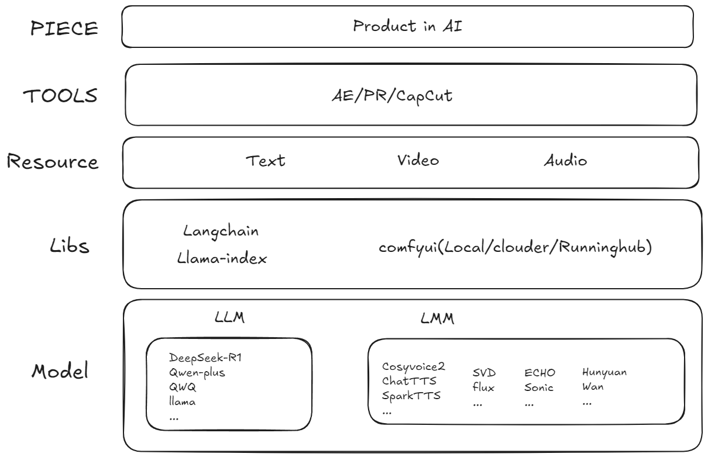
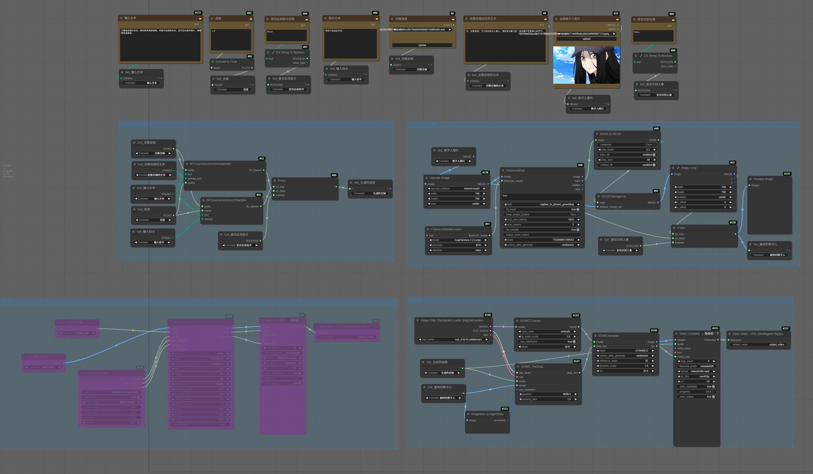
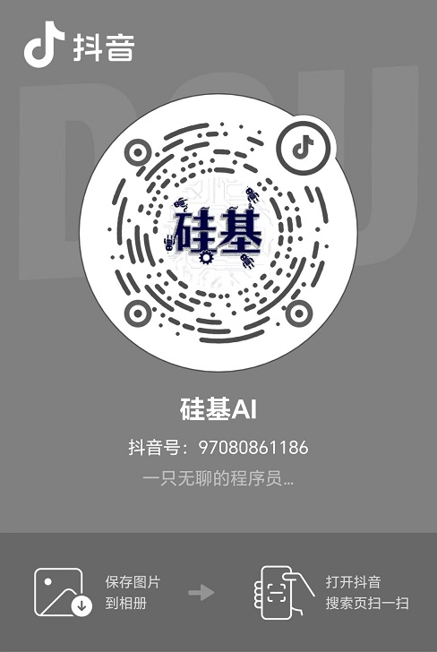

# Silicon AI 

**硅基AI** 是一个以大模型AI为技术底座，语音、视频为载体，提供AI内容产出（娱乐节目、前言知识分享等）的开源项目

## 主要功能

- **辩论赛底稿生成**: 根据辩题和人物设定自动生成全部辩论赛底稿文案。

- **人物音色克隆**: 支持基于人物设定中提供的克隆声音及文本进行音色克隆

- **语音驱动头像**：支持基于提供的语音和人物头像，生成人物对口型视频

- **视频分段合成**: 支持将文本自动拆分，生成视频后自动合并，形成长视频

## 架构设计




## 模块说明：

### 1. debate：

**辩论赛娱乐项目**

输入参数：

- `llm_name`：使用的模型

- `pro_side_roles`：正方角色

- `con_side_roles`：反方角色

- `topic`：主题

- `pro_side_topic`：正方观点

- `con_side_topic`：反方观点


<details>

<summary>文本驱动口型comfyui节点图</summary>



https://www.runninghub.cn/ai-detail/1895143355112357890

</details>

### 2. 敬请期待...

## 使用须知

- **阿里百炼**：本项目所有的文本大模型都基于阿里百炼的API接口

- **RunningHub**: 本项目多态大模型均使用Runninghub提供的comfyui平台搭建

## 使用方法：

1. 安装依赖

```python
# 安装依赖
pip install -r requirements
```

2. 修改配置文件`config.ini`

```ini
[proxy]
# 如需要配置地址
http_proxy=
https_proxy=

[running_hub]
# 配置工作流地址
debate_text2video_workflowId = 1895284888067571714
debate_text2voice_workflowId =
```

3. 配置环境变量

```shell
# （必选）配置 runninghub的api_key
export RUNNING_HUB_API_KEY=
# （必选）配置阿里百炼的api_key
export TONGYI_API_KEY=
# （可选）输出路径，默认在data目录
export SILICON_AI_DATA=
```

4. 启动辩论赛

```shell
cd app/debate
python main.py
```

## 谢谢

欢迎关注抖音、b站


